# Laboratory 1: Convolutional Neural Networks
This is a repository for the lab 1 of the course deep learning application

## Exercise 1
In this exercise I implemented a simple Multilayer Perceptron and a simple CNN to classify the 10 class of CIFAR10.
I have also implemented a fullyConvolutional version of the ConvNet, in which the final fully connected layer is substituted by a bottleneck, with number of filters equal to the number of class, and global average pooling.
The purpose of this exercise is to show that deeper networks do not always work better.

- MLP:
    Here are presented the validation accuracy, the loss during training and test accuracy with different depths:

  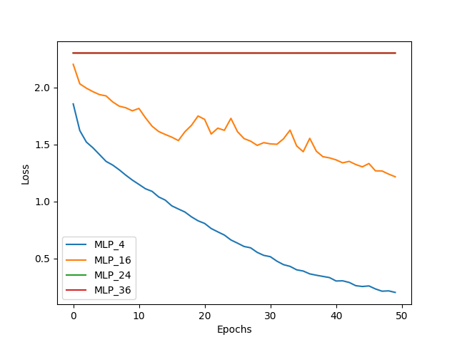
   
  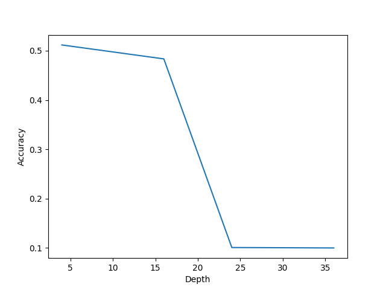

 
    As we can see the model that works better is the shallower, deeper model performs much worse and even cannot be trained because of the vanishing gradient problem.

[//]: # (    Here is the accuracy on test set varying the network depht: ![Test_MLP.png]&#40;test_depth_MLP%2FTest_MLP.png&#41;)

- Convolutional Network:
    Here are presented the validation accuracy, the loss during training and test accuracy with different depths:

  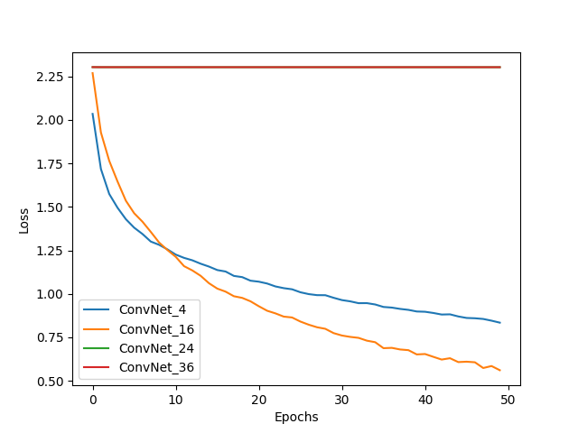
  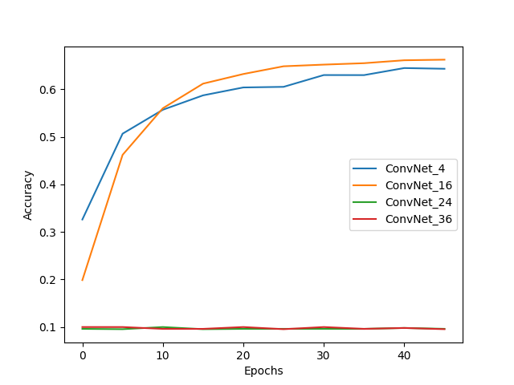 
  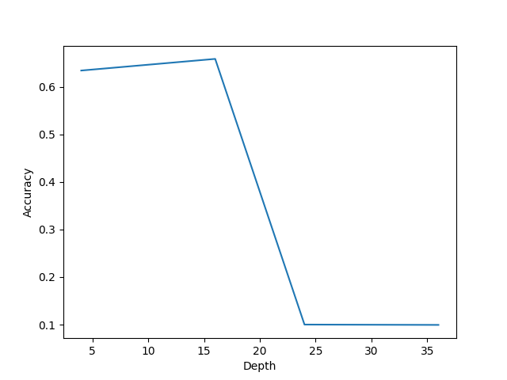

 
    The results for MLP are confirmed for ConvNets, if network is too deep it's impossible to train if we don't do specific adjustments, but the deeper network that can be trained performs better than the shallow one, this can be due a much larger receptive field for the last layers of the network.

[//]: # (    Here is the accuracy on test set varying the network depht: ![Test_ConvNet.png]&#40;test_depth_conv%2FTest_ConvNet.png&#41;)

- Fully Convolutional Network:
    Here are presented the validation accuracy, the loss during training and test accuracy with different depths:

  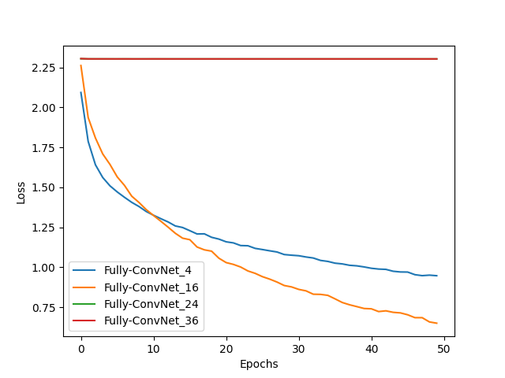
  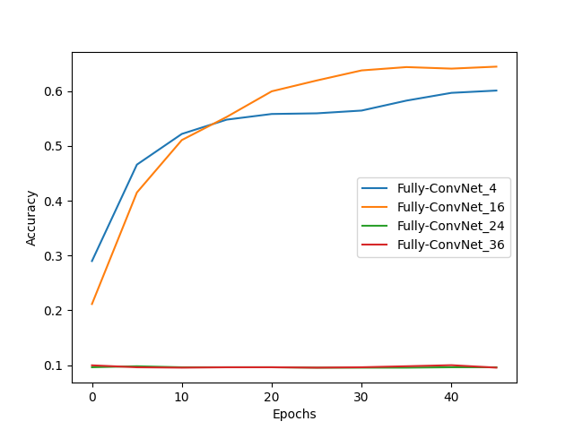 
  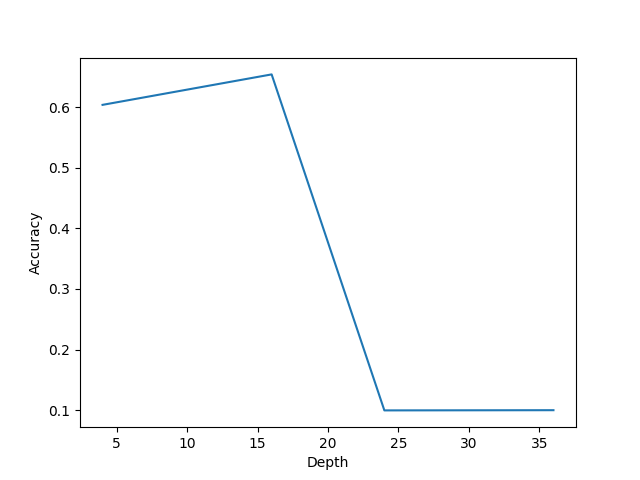

 
    The Fully Convolutional Network confirms the results of the others models.

[//]: # (    Here is the accuracy on test set varying the network depht: ![Test_Fully-ConvNet.png]&#40;test_depth_fullyconv%2FTest_Fully-ConvNet.png&#41;)

## Exercise 2
In this exercise I'm going to analyze how residual blocks reduce the problems linked to really deep networks. Residual blocks are easy to implement but very powerful, they allow gradient to backpropagate easier to the early layers of the network, and they make easier for the network to learn identity if a layer is not needed.

Here show the same graphs as exercise 1 with residual blocks:

- MLP with residual blocks:
    Here are presented the validation accuracy, the loss during training and test accuracy with different depths:

  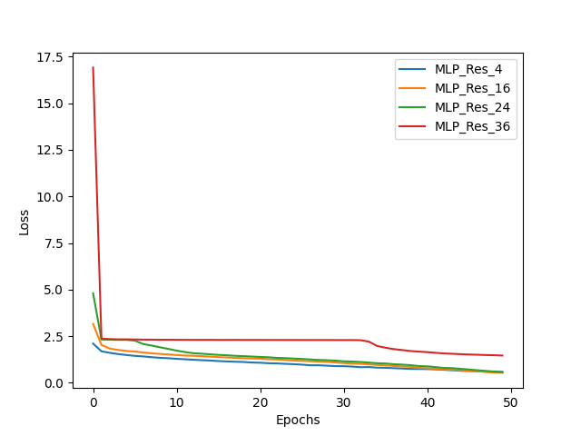
  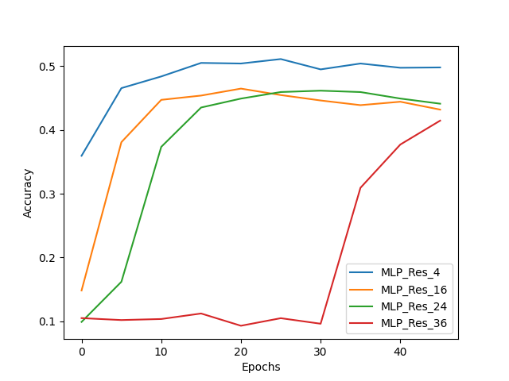 
  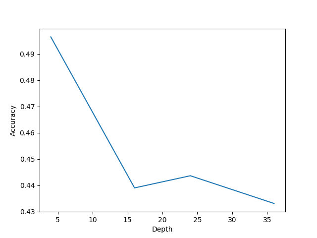

 
    The results for deeper networks are so much better now, but we can see that deeper network still performs worse than shallow ones. This is probably due to the fact that this network structure is not well suited for the task. Convnets are much better for image classification because they can exploit the spatial structure of images.

[//]: # (    Here is the accuracy on test set varying the network depht:![Test_MLP_Res.png]&#40;test_depth_MLP_res%2FTest_MLP_Res.png&#41;)
- Convolutional Network with residual blocks:
    Here are presented the validation accuracy, the loss during training and test accuracy with different depths:

  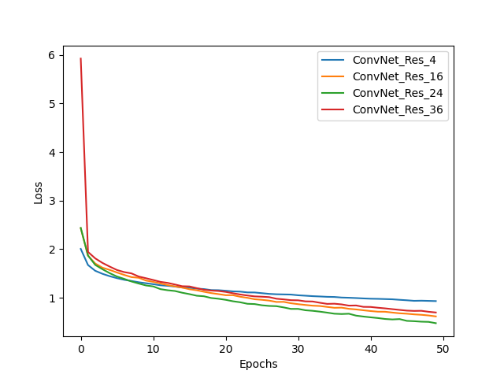
  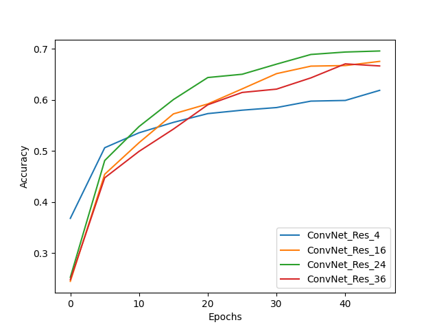 
  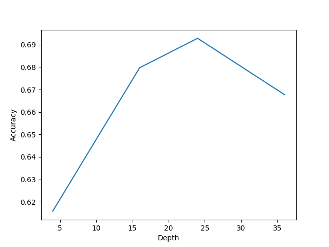

 
    Here we can see the effectiveness of the residual block the deeper networks now can be trained and also performs better than the shallow ones. We can also see an improvement in the test accuracy.

[//]: # (    Here is the accuracy on test set varying the network depht:)

[//]: # (   ![Test_MLP_Res.png]&#40;test_depth_MLP_res%2FTest_MLP_Res.png&#41;)
- Fully Convolutional Network with residual blocks:
    Here are presented the validation accuracy, the loss during training and test accuracy with different depths:

  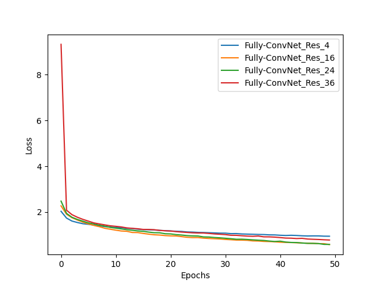
  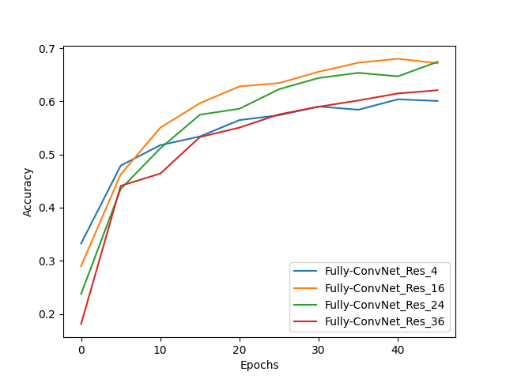 
  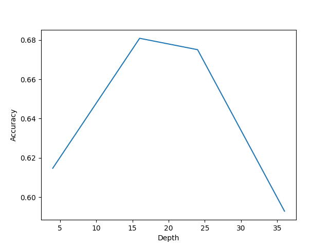

 
    The results with Fully Convolutional Network are in line with the ones for convolutional networks.

[//]: # (    Here is the accuracy on test set varying the network depht:)

[//]: # (   ![Test_Fully-ConvNet_Res.png]&#40;test_depth_fullyconv_res%2FTest_Fully-ConvNet_Res.png&#41;)

To verify the idea that the magnitude of the gradients of the first layers is bigger if we use residual block here are the heatmaps of the gradient of the first filter of the Convolutional network:

- After 2 epochs:                            
    

      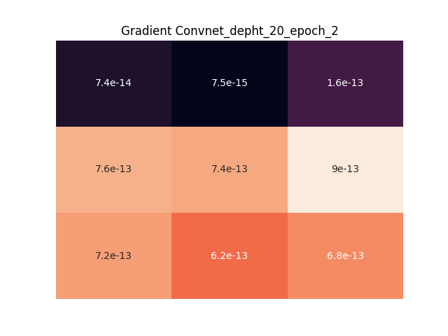
      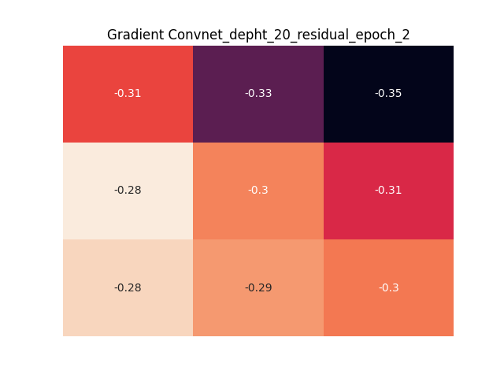
    

    

      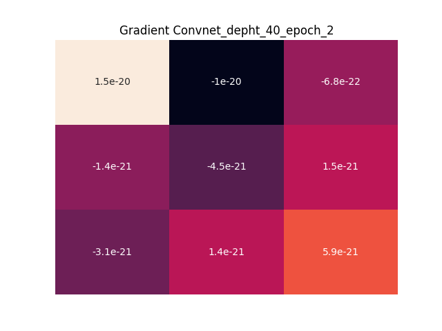
      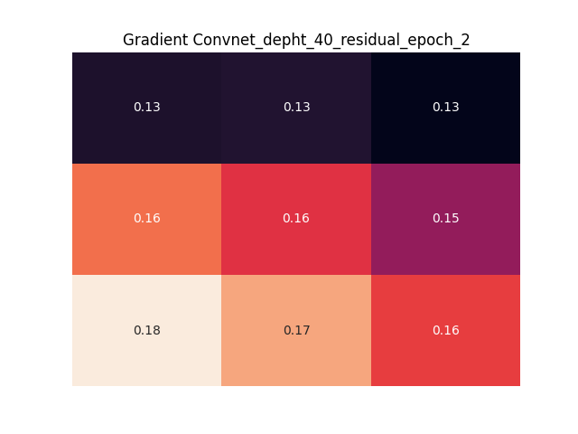
    
 
- After 30 epochs:
    

      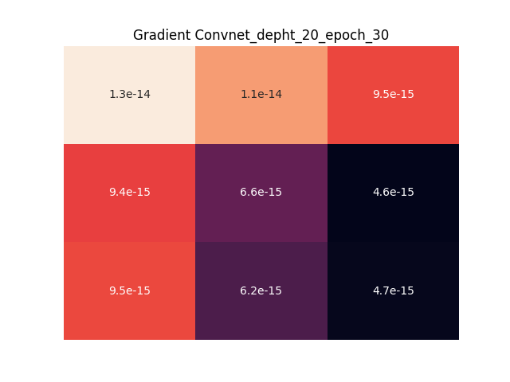
      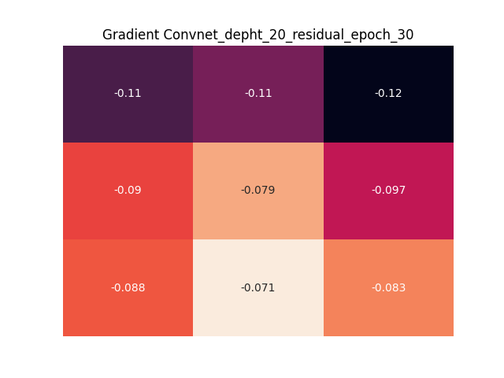
    

    

      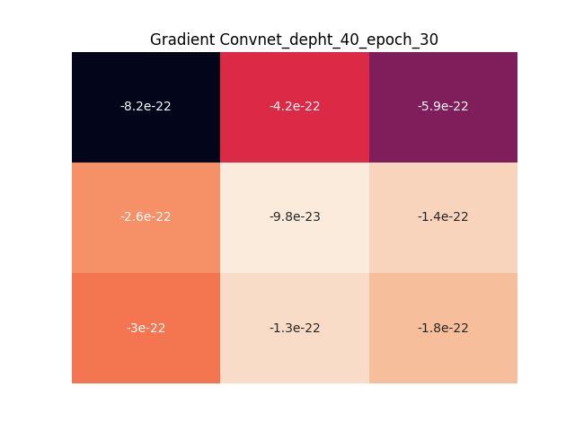
      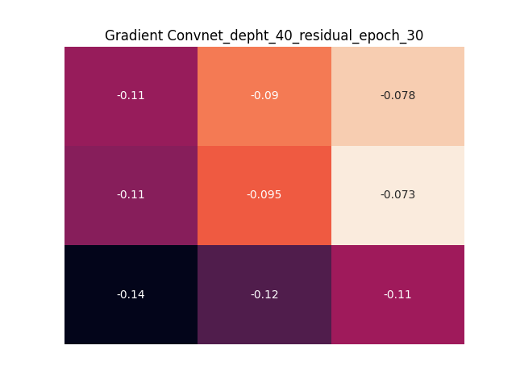
    
 
    We can see how huge is the difference of magnitude, this confirms that residual blocks help to reduce the vanishing gradient.
